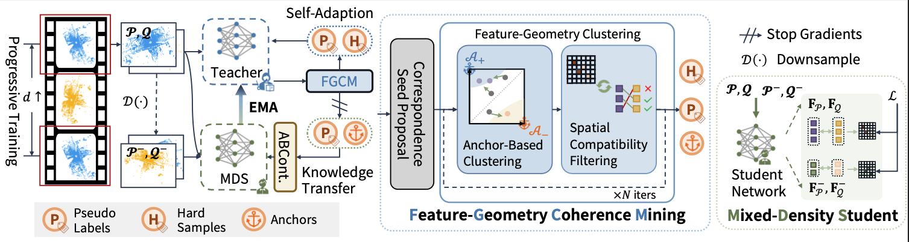

# INTEGER: [NeurIPS 2024] Mining and Transferring Feature-Geometry Coherence for Unsupervised Point Cloud Registration

Official PyTorch implementation of the paper: *[Mining and Transferring Feature-Geometry Coherence for Unsupervised Point Cloud Registration](https://neurips.cc/virtual/2024/poster/95385)*

## Abstract

Point cloud registration, a fundamental task in 3D vision, has achieved remarkable success with learning-based methods in outdoor environments. Unsupervised outdoor point cloud registration methods have recently emerged to circumvent the need for costly pose annotations. However, they fail to establish reliable optimization objectives for unsupervised training, either relying on overly strong geometric assumptions, or suffering from poor-quality pseudo-labels due to inadequate integration of low-level geometric and high-level contextual information. We have observed that in the feature space, latent new inlier correspondences tend to cluster around respective positive anchors that summarize features of existing inliers. Motivated by this observation, we propose a novel unsupervised registration method termed INTEGER to incorporate high-level contextual information for reliable pseudo-label mining. Specifically, we propose the Feature-Geometry Coherence Mining module to dynamically adapt the teacher for each mini-batch of data during training and discover reliable pseudo-labels by considering both high-level feature representations and low-level geometric cues. Furthermore, we propose Anchor-Based Contrastive Learning to facilitate contrastive learning with anchors for a robust feature space. Lastly, we introduce a Mixed-Density Student to learn density-invariant features, addressing challenges related to density variation and low overlap in the outdoor scenario. Extensive experiments on KITTI and nuScenes datasets demonstrate that our INTEGER achieves competitive performance in terms of accuracy and generalizability.

## News

- **2024-09-26**: Our paper is avaiable on [arXiv](https://arxiv.org/abs/2411.01870).

- **2024-09-26**: This work is accepted by NeurIPS 2024. Code and Models on KITTI will be released soon.

## Installation

Coming Soon.

## KITTI Odometry

Coming Soon.

## Acknowlegdements

Our implementation is based on various wonderful previous works, including: 

- [FCGF](https://github.com/chrischoy/FCGF) and [EYOC](https://github.com/liuQuan98/EYOC);
- [SC2-PCR](https://github.com/ZhiChen902/SC2-PCR);
- [GeoTransformer](https://github.com/qinzheng93/GeoTransformer);

